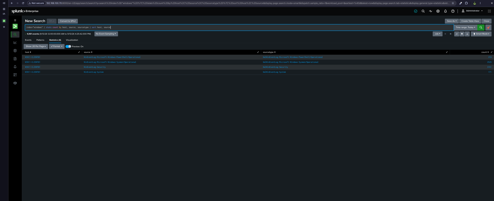
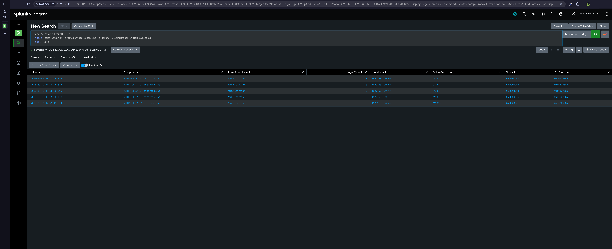
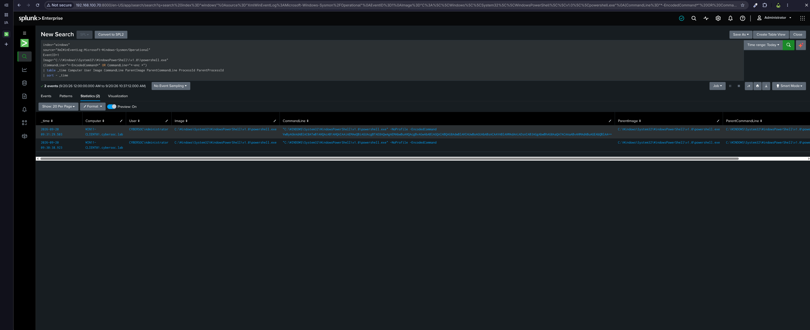
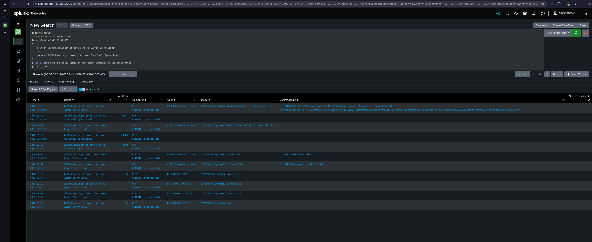
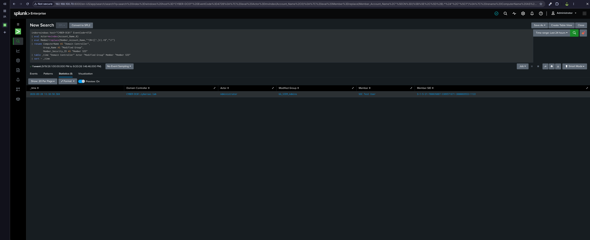
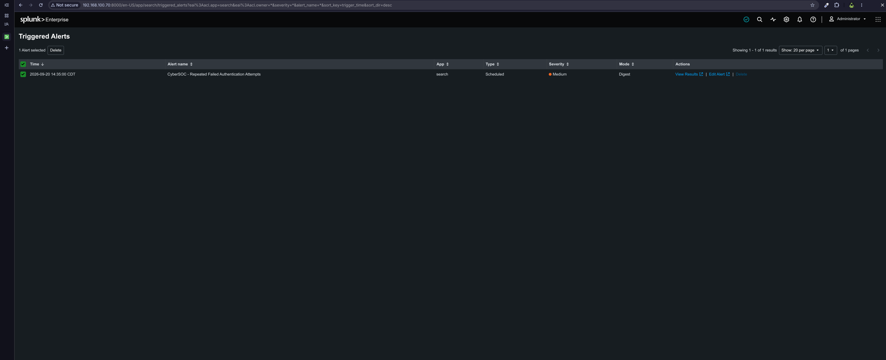
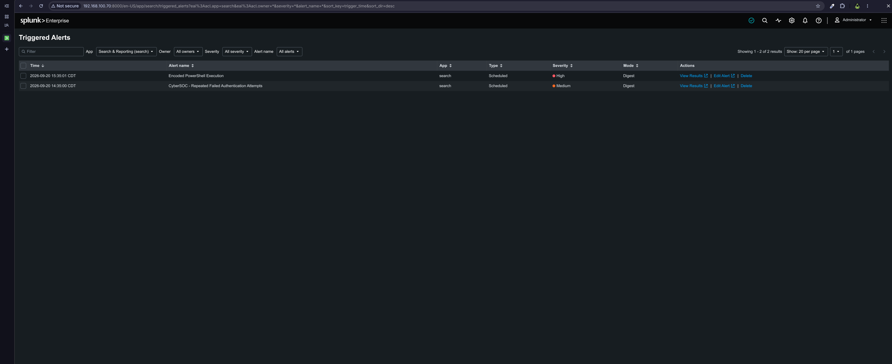
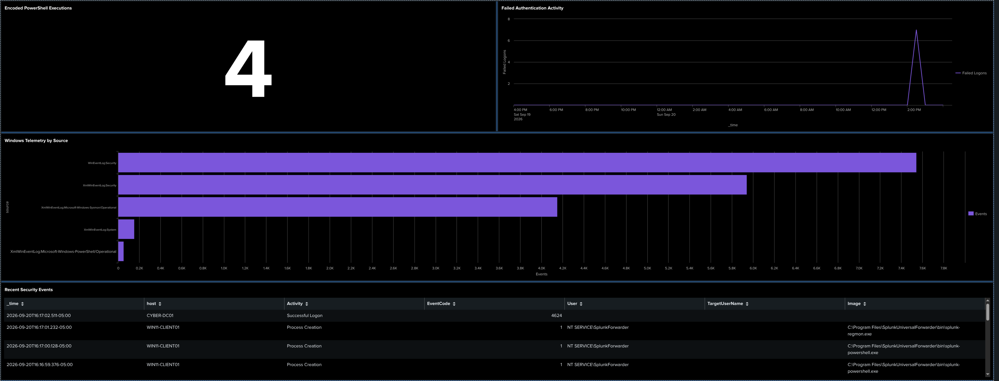

A centralized Security Information and Event Management (SIEM) project built with Splunk Enterprise to collect, investigate, correlate, and alert on Windows security telemetry from an isolated Active Directory home lab.

This project focuses on the operational workflow of a SOC analyst: onboarding telemetry, validating log coverage, developing SPL searches, generating controlled security activity, investigating endpoint and authentication events, operationalizing searches as alerts, and presenting security activity through a centralized SOC dashboard.

---

## Project Overview

The goal of this project was to build a functional SIEM environment capable of monitoring activity across the CyberSOC lab.

Splunk Enterprise was deployed as the centralized SIEM platform. Windows Security, System, PowerShell, and Sysmon telemetry was forwarded from monitored Windows systems using Splunk Universal Forwarders.

Controlled activity was then generated to validate the monitoring pipeline and investigate two security scenarios:

1. Repeated failed SMB authentication originating from the Kali Linux attacker.
2. Encoded PowerShell execution on the Windows 11 endpoint.

The validated searches were operationalized as scheduled Splunk alerts and incorporated into a SOC dashboard for centralized monitoring.

### Security Monitoring Workflow

```text
Endpoint / Identity Activity
        ↓
Windows Event Logs + Sysmon
        ↓
Splunk Universal Forwarder
        ↓
Splunk Enterprise
        ↓
SPL Search and Investigation
        ↓
Security Alert
        ↓
SOC Dashboard
```

---

## Lab Architecture

The SIEM was integrated into the existing isolated CyberSOC VMware environment.

| System | Role | IP Address |
|---|---|---|
| `CYBER-DC01` | Active Directory Domain Controller / DNS | `192.168.100.10` |
| `WIN11-CLIENT01` | Domain-joined Windows endpoint | `192.168.100.20` |
| `KALI-ATTACKER01` | Controlled attack system | `192.168.100.40` |
| `SPLUNK-SIEM01` | Splunk Enterprise SIEM | `192.168.100.70` |

The environment operates on the isolated VMware host-only network:

```text
VMnet2
192.168.100.0/24
```

`SPLUNK-SIEM01` runs Ubuntu Server 24.04 LTS and remains standalone rather than joining the Active Directory domain.

---

## Technology Stack

| Technology | Purpose |
|---|---|
| Splunk Enterprise 10.4 | Centralized SIEM, search, alerting, and dashboards |
| Splunk Universal Forwarder | Windows log forwarding |
| Splunk Add-on for Microsoft Windows | Windows field extraction and normalization |
| Microsoft Sysmon | Enhanced endpoint process telemetry |
| Windows Security Event Log | Authentication and security auditing |
| PowerShell Operational Log | PowerShell telemetry |
| Active Directory Domain Services | Identity infrastructure |
| Kali Linux | Controlled security testing |
| VMware Workstation Pro | Virtualized lab infrastructure |
| Ubuntu Server 24.04 LTS | Splunk server operating system |
| SPL | Threat hunting, investigation, and alert logic |

---

# 1. Splunk Enterprise Deployment

A dedicated Ubuntu Server virtual machine was deployed as `SPLUNK-SIEM01`.

The VM was configured with:

- 4 vCPUs
- 8 GB RAM
- 80 GB virtual disk
- Static VMnet2 address `192.168.100.70`
- Temporary NAT connectivity for installation and updates

During deployment, the Ubuntu installer initially allocated only approximately half of the available LVM storage to the root logical volume. The remaining capacity was extended into the root filesystem before Splunk installation to prevent future storage constraints.

Splunk Enterprise was installed under:

```text
/opt/splunk
```

A dedicated non root Linux service account was created:

```text
splunksvc
```

Splunk was configured to start through systemd and run under this account rather than as `root`.

The Splunk Web interface became available at:

```text
http://192.168.100.70:8000
```

The server was also configured as a Splunk receiving indexer on TCP port:

```text
9997
```

---

# 2. Windows Telemetry Collection

Splunk Universal Forwarder was deployed to the monitored Windows systems.

The initial telemetry source was `WIN11-CLIENT01`.

A dedicated Universal Forwarder application was created:

```text
C:\Program Files\SplunkUniversalForwarder\etc\apps\CyberSOC_Windows\
```

The local `inputs.conf` enabled collection of:

```ini
[WinEventLog://Security]
disabled = 0
index = windows
renderXml = true

[WinEventLog://System]
disabled = 0
index = windows
renderXml = true

[WinEventLog://Microsoft-Windows-Sysmon/Operational]
disabled = 0
index = windows
renderXml = true

[WinEventLog://Microsoft-Windows-PowerShell/Operational]
disabled = 0
index = windows
renderXml = true
```

A dedicated Splunk index was used:

```text
windows
```

Forwarder connectivity to the Splunk server was validated through:

```text
192.168.100.70:9997
```

---

## Sysmon Collection Permission Issue

During telemetry onboarding, Windows Security, System, and PowerShell events were successfully ingested, but Sysmon events were initially absent.

Universal Forwarder logs showed that the Sysmon subscription failed with:

```text
errorCode=5
```

The Splunk Universal Forwarder service was running under:

```text
NT SERVICE\SplunkForwarder
```

Rather than changing the service to run as Local System, the service identity was added to the local **Event Log Readers** group:

```powershell
Add-LocalGroupMember `
    -Group "Event Log Readers" `
    -Member "NT SERVICE\SplunkForwarder"
```

After restarting the forwarder, Sysmon telemetry began appearing in Splunk.

This preserved the forwarder's least privileged service configuration while granting the access required to read the Sysmon Operational channel.

---

## Telemetry Validation

The following SPL was used to validate the telemetry sources:

```spl
index=windows
| stats count by host, source, sourcetype
| sort host, source
```

The search confirmed ingestion from:

- Windows Security
- Windows System
- Microsoft Sysmon Operational
- Microsoft PowerShell Operational



**Evidence:** The Windows endpoint is successfully forwarding multiple security relevant event channels into the centralized `windows` index.

---

# 3. Splunk Windows Normalization

The **Splunk Add-on for Microsoft Windows** was installed to provide supported Windows knowledge objects, field extractions, and normalization.

The existing `CyberSOC_Windows` Universal Forwarder configuration remained responsible for collection. The add-on was used for search-time enrichment rather than replacing the working input configuration.

Windows Security telemetry exposed fields useful for SOC investigations, including:

```text
EventCode
Computer
SubjectUserName
TargetUserName
IpAddress
LogonType
```

This allowed raw Windows events to be transformed into analyst friendly SPL searches.

---

# 4. Security Scenario 1 — Failed SMB Authentication

The first controlled security scenario simulated repeated authentication failures originating from the Kali Linux system.

```text
KALI-ATTACKER01
192.168.100.40
        ↓
SMB Authentication
        ↓
WIN11-CLIENT01
192.168.100.20
        ↓
Windows Security Event 4625
        ↓
Splunk
```

The activity produced multiple Windows Security Event ID `4625` events.

Investigation identified:

| Field | Observed Value |
|---|---|
| EventCode | `4625` |
| Target Account | `Administrator` |
| Logon Type | `3` |
| Source Address | `192.168.100.40` |
| Source System | `KALI-ATTACKER01` |
| Status | `0xc000006d` |
| SubStatus | `0xc000006a` |

Logon Type `3` identified the activity as a network authentication attempt.

The source address correlated directly with the Kali attacker system.



**Evidence:** Splunk correlated repeated Windows authentication failures with the Kali system responsible for the controlled SMB activity.

### Investigation Outcome

The events demonstrated how a SOC analyst can pivot from a Windows failed logon event to:

- the affected endpoint,
- targeted account,
- authentication method,
- source address,
- event frequency,
- and originating system.

This activity became the basis for the first Splunk security alert.

---

# 5. Security Scenario 2 — Encoded PowerShell Execution

The second scenario tested endpoint process visibility using PowerShell and Sysmon.

A controlled PowerShell command was encoded as Base64 and executed using the `EncodedCommand` parameter.

Example test structure:

```powershell
$Command = 'Get-Process | Select-Object -First 5; Start-Process notepad.exe'

$Encoded = [Convert]::ToBase64String(
    [Text.Encoding]::Unicode.GetBytes($Command)
)

powershell.exe -NoProfile -EncodedCommand $Encoded
```

The activity was intentionally benign. The purpose was to reproduce a command line pattern that is useful during endpoint threat hunting while remaining completely controlled inside the lab.

Splunk successfully identified the PowerShell process execution through Sysmon Event ID `1`.



**Evidence:** Splunk exposes the PowerShell process, command line arguments, user context, parent process, and associated Sysmon process creation telemetry.

---

## PowerShell Activity Correlation

The investigation was expanded beyond a single event to correlate endpoint activity surrounding the PowerShell execution.

Sysmon process telemetry and PowerShell Operational logging provided visibility into related execution activity and process context.

The investigation demonstrated the ability to move from a suspicious command line pattern into surrounding endpoint telemetry rather than evaluating a single event in isolation.



**Evidence:** Multiple telemetry sources can be correlated in Splunk to reconstruct activity surrounding a PowerShell execution.

---

# 6. Domain Controller Security Telemetry

The Splunk Universal Forwarder was also deployed to `CYBER-DC01` to extend centralized visibility into Active Directory security activity.

A dedicated forwarder application was used for Domain Controller collection, with Windows Security telemetry forwarded into the existing:

```text
index=windows
```

This extended the SIEM beyond a single endpoint and introduced identity infrastructure telemetry into the centralized monitoring environment.



**Evidence:** The centralized SIEM receives security telemetry from both the Windows workstation and Active Directory infrastructure.

This provided additional identity context for searches and contributed to the multi host security activity displayed in the final SOC dashboard.

---

# 7. Splunk Alerting

After validating the investigation searches, selected behaviors were converted into scheduled Splunk alerts.

The objective was not simply to demonstrate that SPL could locate historical activity, but to operationalize those searches so new matching activity could automatically generate an alert.

---

## Alert 1 — Repeated Failed Authentication Attempts

The failed authentication investigation was converted into a scheduled alert designed to identify repeated Windows authentication failures.

The alert was configured to evaluate recent security telemetry and trigger when the search returned activity meeting the defined threshold.

A positive control test was performed using fresh controlled SMB authentication failures.

Splunk successfully triggered:

```text
CyberSOC - Repeated Failed Authentication Attempts
```

with **Medium** severity.



**Evidence:** Controlled authentication activity successfully traversed the complete monitoring pipeline and generated an operational Splunk alert.

```text
Kali SMB Authentication Attempts
        ↓
Windows Event ID 4625
        ↓
Universal Forwarder
        ↓
Splunk
        ↓
Scheduled SPL Detection
        ↓
Triggered Alert
```

---

## Alert 2 — Encoded PowerShell Execution

The PowerShell investigation search was refined into a focused behavioral alert.

The alert search targeted PowerShell process creation containing encoded command line parameters:

```spl
index=windows host="WIN11-CLIENT01"
source="XmlWinEventLog:Microsoft-Windows-Sysmon/Operational"
EventCode=1
Image="*powershell.exe"
(CommandLine="*-EncodedCommand*" OR CommandLine="*-enc *" OR CommandLine="*-e *")
| table _time Computer User Image CommandLine ParentImage ParentCommandLine ProcessId ParentProcessId
| sort - _time
```

The alert was configured as a scheduled search and assigned **High** severity.

A new controlled encoded PowerShell execution was then generated as a positive control test.

Splunk successfully triggered:

```text
Encoded PowerShell Execution
```



The Triggered Alerts view also confirmed that both security detections were operational:

```text
Encoded PowerShell Execution
CyberSOC - Repeated Failed Authentication Attempts
```

This validated the complete PowerShell monitoring chain:

```text
Controlled PowerShell Execution
        ↓
Sysmon Event ID 1
        ↓
Universal Forwarder
        ↓
Splunk
        ↓
Behavioral SPL Search
        ↓
High-Severity Alert
```

---

# 8. SOC Security Operations Dashboard

A centralized dashboard was created using **Splunk Dashboard Studio**.

The dashboard was designed to provide a compact operational view rather than displaying every available event or metric.

## Dashboard Panels

### Encoded PowerShell Executions

A single value visualization displays the number of encoded PowerShell executions detected during the selected time range.

```spl
index=windows host="WIN11-CLIENT01"
source="XmlWinEventLog:Microsoft-Windows-Sysmon/Operational"
EventCode=1
Image="*powershell.exe"
(CommandLine="*-EncodedCommand*" OR CommandLine="*-enc *" OR CommandLine="*-e *")
| stats count AS "Encoded PowerShell Executions"
```

### Failed Authentication Activity

Authentication failures are displayed as a time series visualization to make spikes immediately visible.

```spl
index=windows EventCode=4625
| timechart span=30m count AS "Failed Logons"
```

### Windows Telemetry by Source

Event volume is grouped by source to provide visibility into telemetry coverage.

```spl
index=windows
| stats count AS Events by source
| sort - Events
```

### Recent Security Events

A triage table provides recent authentication and process creation activity across monitored systems.

```spl
index=windows
(EventCode=4624 OR EventCode=4625 OR EventCode=1)
| eval Activity=case(
    EventCode=4625, "Failed Logon",
    EventCode=4624, "Successful Logon",
    EventCode=1, "Process Creation"
)
| table _time host Activity EventCode User TargetUserName Image
| sort - _time
| head 20
```

The dashboard includes a global time range selector so analysts can pivot the same visualizations across different investigation windows.



The completed dashboard provides four complementary SOC views:

- suspicious endpoint activity,
- authentication trends,
- telemetry coverage,
- and recent events for analyst triage.

---

# Investigation Findings

## Failed Authentication Activity

The authentication investigation demonstrated that centralized Windows Security telemetry can identify the source and context of repeated network logon failures.

Splunk correlated Event ID `4625` activity with:

```text
Source: 192.168.100.40
System: KALI-ATTACKER01
Target: WIN11-CLIENT01
Account: Administrator
Logon Type: 3
```

This allowed controlled SMB authentication activity to be traced from the originating attacker system to the affected Windows endpoint.

---

## Encoded PowerShell Activity

Sysmon process creation telemetry exposed PowerShell execution with:

```text
powershell.exe -NoProfile -EncodedCommand <Base64>
```

The investigation provided visibility into:

- executable path,
- command line,
- user context,
- parent process,
- parent command line,
- process ID,
- and related endpoint activity.

This demonstrated why command line telemetry is valuable when investigating PowerShell behavior that cannot be understood from process name alone.

---

# Challenges and Troubleshooting

Several configuration issues were identified and resolved during the project.

## Universal Forwarder Application Path

The Windows telemetry application was initially created under an incorrect directory:

```text
SplunkUniversalForwarders
```

instead of:

```text
SplunkUniversalForwarder
```

Because the directory was outside the active Splunk installation, the Universal Forwarder did not load the intended `inputs.conf`.

The incorrect directory was removed and the application was recreated under the correct path.

---

## Sysmon Access Denied

Sysmon was enabled and generating events locally, but the Universal Forwarder initially failed to subscribe to the channel.

Forwarder logs identified:

```text
errorCode=5
```

The issue was resolved by adding:

```text
NT SERVICE\SplunkForwarder
```

to:

```text
Event Log Readers
```

This restored Sysmon collection without unnecessarily changing the service to a more privileged execution context.

---

## Splunk Forwarding Validation

Transport troubleshooting was separated from telemetry troubleshooting.

The Universal Forwarder was independently validated as connected to:

```text
192.168.100.70:9997
```

before investigating individual Windows event channels.

This helped distinguish:

```text
Forwarding problem
```

from:

```text
Event-log collection problem
```

and prevented unnecessary changes to a working network path.

---

# Skills Demonstrated

This project demonstrates hands on experience with:

- SIEM deployment and administration
- Splunk Enterprise
- Splunk Universal Forwarder
- Windows log onboarding
- Sysmon telemetry
- Windows Security auditing
- PowerShell Operational logging
- SPL development
- authentication analysis
- endpoint process investigation
- command line analysis
- multi source telemetry correlation
- alert development
- positive control validation
- Dashboard Studio
- SOC dashboard design
- Active Directory monitoring
- troubleshooting log ingestion pipelines
- least privilege service configuration
- security event triage

---

# Key Takeaways

A functional SIEM requires more than installing a platform and forwarding logs.

This project reinforced the importance of validating the entire monitoring chain:

```text
Activity
→ Telemetry
→ Collection
→ Ingestion
→ Parsing
→ Investigation
→ Alerting
→ Visualization
```

The most important lesson was separating each layer during troubleshooting.

A forwarder can be connected while an individual event channel is still inaccessible. An event can be searchable without the search being suitable for alerting. An alert can exist without having been validated against fresh activity.

By testing each stage independently, the final environment moved from basic log collection to an operational SOC monitoring workflow.

---

# Project Outcome

The completed CyberSOC SIEM environment now provides centralized visibility across Windows endpoint and identity infrastructure telemetry.

The project successfully demonstrated:

- centralized Windows telemetry ingestion,
- Security, System, Sysmon, and PowerShell collection,
- normalized Windows event searching,
- failed authentication investigation,
- encoded PowerShell investigation,
- endpoint activity correlation,
- multi host monitoring,
- scheduled security alerts,
- positive control alert validation,
- and a centralized SOC operations dashboard.

Two security behaviors were taken through the complete SIEM lifecycle:

```text
Controlled Activity
        ↓
Telemetry Generation
        ↓
Centralized Ingestion
        ↓
SPL Investigation
        ↓
Detection Logic
        ↓
Scheduled Alert
        ↓
Positive-Control Validation
        ↓
SOC Visualization
```

This completes the **CyberSOC-SIEM** project and establishes the centralized monitoring layer for the broader CyberSOC portfolio.

---

## Portfolio Progression

This project is part of the larger CyberSOC portfolio:

```text
CyberSOC-HomeLab-Foundation
        ↓
CyberSOC-AD-Attack-Detection
        ↓
CyberSOC-Vulnerability-Management
        ↓
CyberSOC-SIEM
        ↓
CyberSOC-Detection-Engineering
        ↓
CyberSOC-Incident-Response
```

The next project will build on this monitoring experience by focusing specifically on **Detection Engineering with Microsoft Sentinel and KQL**.
